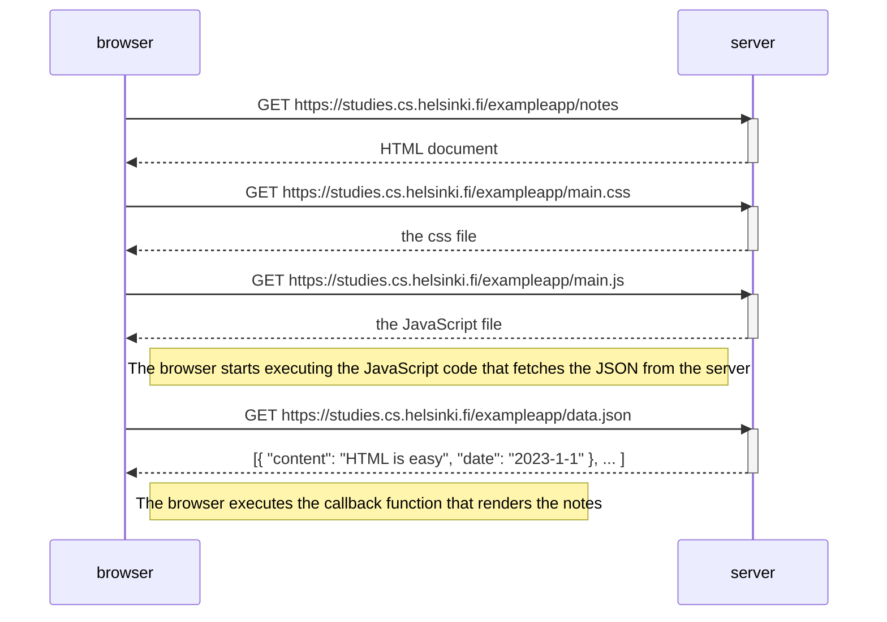
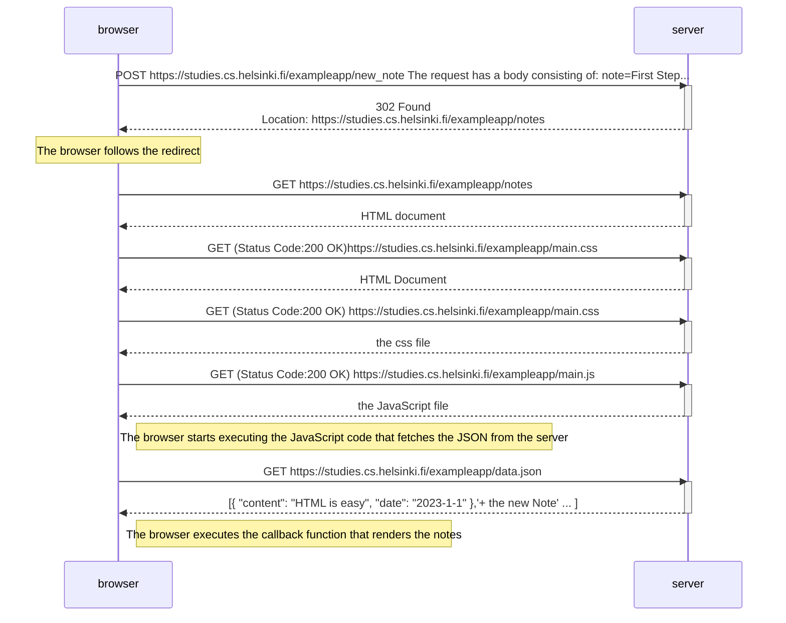

 ###### This is the sequence of http request and responses when the use will access the page: 
 https://studies.cs.helsinki.fi/exampleapp/notes

    
###### and this is the sequence of https requests and responses happen when the user add a new note which is "First step for me in this course"

